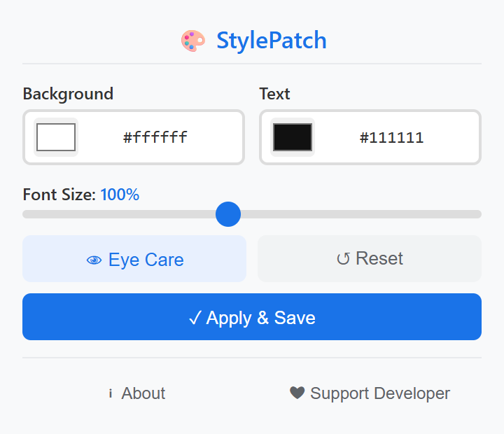

# StylePatch

A lightweight browser extension that lets you customize any webpage's background color, text color, and font size instantly.

> Chromium-based · Manifest V3 · Zero tracking · Per-site settings

---

## Features

| Feature | Description |
|---------|-------------|
| 🎨 **Background & Text Color** | Pick any color via native color picker or type hex code directly |
| 🔠 **Font Size Scaling** | Adjust from 60% to 150%, works on sites using fixed px values |
| 👁️ **Eye Care Mode** | One-click warm tone preset for comfortable reading |
| 💾 **Per-Site Settings** | Save different styles for different websites, auto-restore on revisit |
| ⚡ **Real-Time Preview** | All changes apply instantly as you drag, no page reload needed |
| 🔄 **Dynamic Content** | Automatically styles dynamically loaded content (SPA, lazy load) |
| 🔒 **Minimal Permissions** | Only `activeTab` + `storage` — no unnecessary access |

---

## Preview

  

---

## Supported Browsers

| Browser | Status |
|---------|--------|
| Google Chrome | ✅ Fully supported |
| Microsoft Edge | ✅ Fully supported |
| Other Chromium-based browsers | ✅ Should work |

---

## Installation

1. Open your browser's extension page:
   - **Chrome**: `chrome://extensions/`
   - **Edge**: `edge://extensions/`
2. Enable **Developer mode** (top-right toggle)
3. Click **Load unpacked** and select the project folder
4. Click the StylePatch icon in your toolbar to start

---

## Usage

1. **Click the StylePatch icon** in your browser toolbar
2. **Pick colors** — Use the native color picker or type a hex code
3. **Adjust font size** — Drag the slider from 60% to 150%
4. **Eye Care mode** — Click 👁 for a warm, comfortable reading theme
5. **Save** — Click **Apply & Save** to persist settings for this site
6. **Reset** — Click ↺ to restore the site's default appearance

Settings are automatically saved when the popup closes, and restored when you revisit the same site.

---

## Privacy

- Only `activeTab` + `storage` permissions — nothing more
- No browsing history access, no user tracking, no external data transmission
- All data stays local in your browser

---

## License

Copyright © 2026 StylePatch. All rights reserved.

---

> **Note:** This repository is for **project showcase purposes only**. It does not contain the full source code, manifest, icons, or build scripts. Full source code will **not** be published here.
